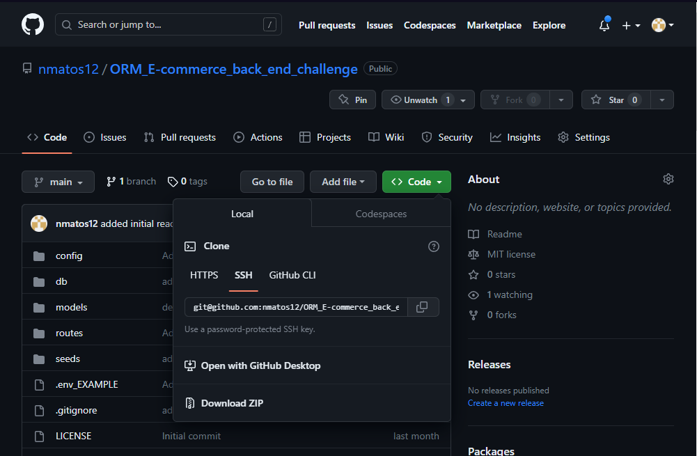

# ORM E-commerce Back End Challenge


## Table of Contents
* [Description](#description)
* [Installation](#installation)
* [Usage](#usage)
* [Demos](#demos)
* [Credits](#credits)
* [License](#license)

## Description

This applications features a e-commerce back-end SQL database using Mysql and Sequlize. The app allows for users to manage products and preform CRUD functions through the use of insomnia.

## Installation

### Requires

- MYSQL
- Node.js
- NPMs:
    - Express
    - Dotenv
    - Mysql2
    - Sequelize
    - Nodemon

### How to Install Application

- Step 1
    - Create an empty repo (You can use a similar name to the repo you're cloning)
- Step 2
    - Copy code from [repo](https://github.com/nmatos12/ORM_E-commerce_back_end_challenge)
    
- Step 3
    - In terminal clone the employee manager repo using the copied code
    - ``` $ git clone git@github.com:nmatos12/ORM_E-commerce_back_end_challenge.git ```
- Step 4
    - Use the following code to change the origin's URL of your remote repository
    - ``` $ git remote set-url origin http://github.com/YOU/YOUR_REPO ```
- Step 5
    - Now you can install the npm's using the following lines of code
    - ``` $ npm init -y ```
    - ``` $ npm i ```
- Step 6 
    - You must now create your database using Mysql, login to your Mysql and use the following
    - ``` $ source db/schema.sql ```
- Step 7
    - Once your database is created you can now seed it using the following
    - ``` $ npm run seed ```
- Step 8
    - Now that your database is created and the seed code is added you can start the server using the following
    - ``` $ npm run watch ```
- Step 9
    - Please use insomina to access and enable CRUD functionalities

## Usage

JavaScript, MYSQL, Markdown

## Demos

Links below provide a functionality of webpage.

[Screencastify Demo](https://watch.screencastify.com)

[MP4 Download Demo](assets/videos/)


## Credits

Rutger University: https://git.bootcampcontent.com/Rutgers-University/RUT-VIRT-FSF-FT-02-2023-U-LOLC

### References:

- [Instuctor Videos: JD Tadlock](https://gist.github.com/jdtdesigns/9cfe05400063902e46aa5f6faabff0ca)


## License

MIT License

Copyright (c) [2023] [Matos,Natalie]

Permission is hereby granted, free of charge, to any person obtaining a copy
of this software and associated documentation files (the "Software"), to deal
in the Software without restriction, including without limitation the rights
to use, copy, modify, merge, publish, distribute, sublicense, and/or sell
copies of the Software, and to permit persons to whom the Software is
furnished to do so, subject to the following conditions:

The above copyright notice and this permission notice shall be included in all
copies or substantial portions of the Software.

THE SOFTWARE IS PROVIDED "AS IS", WITHOUT WARRANTY OF ANY KIND, EXPRESS OR
IMPLIED, INCLUDING BUT NOT LIMITED TO THE WARRANTIES OF MERCHANTABILITY,
FITNESS FOR A PARTICULAR PURPOSE AND NONINFRINGEMENT. IN NO EVENT SHALL THE
AUTHORS OR COPYRIGHT HOLDERS BE LIABLE FOR ANY CLAIM, DAMAGES OR OTHER
LIABILITY, WHETHER IN AN ACTION OF CONTRACT, TORT OR OTHERWISE, ARISING FROM,
OUT OF OR IN CONNECTION WITH THE SOFTWARE OR THE USE OR OTHER DEALINGS IN THE
SOFTWARE.